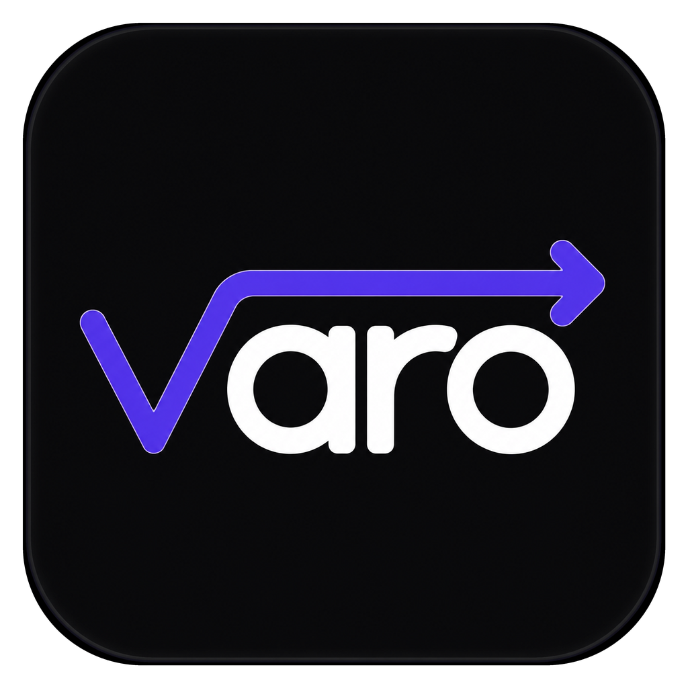

<p align="center">
  
</p>


# Varo

AI-assisted desktop tooling for translating Japanese games, manga images, and video subtitles.

[](https://api.closedclaws.com/api/download/launcher)
[](LICENSE)
[](https://discord.gg/a6FXkPrFAZ)
[](https://rag91560.fanbox.cc/)
[](https://www.patreon.com/c/rag91560)

Varo helps players and fan-localization maintainers scan a game folder, extract translatable text, run offline or provider-backed translation, apply the result, and roll back when needed. The project is local-first: game files stay on the user's machine unless the user explicitly configures an external AI translation provider.

## Status

- Public repository: https://github.com/rag91560-spec/varo
- Current package version: `1.4.3`
- License: MIT for the launcher, UI, backend orchestration, and repository code
- Platform: Windows desktop first, built with Electron, Next.js, TypeScript, and FastAPI
- Maintainer model: human-maintained with AI coding assistance disclosed in [AI_ASSISTANCE.md](AI_ASSISTANCE.md)

## What Varo Does

- Detects common Japanese game engines and scans their folder structure.
- Extracts strings for translation and stores work in a local library database.
- Supports offline NLLB translation as the free baseline.
- Can use higher-quality external AI providers when configured by the user.
- Applies translated text back to supported game formats.
- Keeps rollback and backup paths for safer experimentation.
- Includes adjacent workflows for manga panel OCR and video subtitle translation.
- Provides a desktop auto-update flow for packaged releases.

## Supported Engine Coverage

The table below describes the current maintainer-tested status. Beta entries have parser or apply code but need more real-game reports before they should be treated as stable.

| Engine or workflow | Status |
| --- | --- |
| RPG Maker MV/MZ/VX Ace/XP/2000/2003 | Stable |
| Wolf RPG Editor | Stable |
| Unity IL2CPP/Mono | Stable |
| Unreal Engine | Stable |
| MuMu | Stable |
| DXLib | Stable |
| GDevelop | Beta |
| TyranoScript / TyranoBuilder | Beta |
| Kirikiri KAG3/KS | Beta |
| Ren'Py | Beta |
| RPG in a Box | Beta |
| LiveMaker / LiveNovel | Beta |
| SystemNNN / NScripter | Beta |
| YU-RIS | Beta |
| Manga OCR and video subtitle translation | Active maintenance |

## Repository Scope

This repository contains the open-source desktop launcher, UI, FastAPI backend, local workflow orchestration, documentation, and format-specific adapter code that can be maintained in public.

Some packaged builds may depend on separately distributed engine components or optional provider integrations. Those components are not a transfer of game content, do not include copyrighted game assets, and do not change the MIT license of this repository.

Varo is not a piracy tool and does not ship translated games. Users are responsible for owning legitimate copies of games and complying with the laws and EULAs that apply to their use.

## Quick Start

### Players

1. Download the latest launcher: https://api.closedclaws.com/api/download/launcher
2. Install and open Varo.
3. Add a game folder.
4. Scan, translate, review, apply, and test in-game.

Offline NLLB translation works without a paid provider. External AI providers are optional and should be configured only when the user wants that quality/cost tradeoff.

### Developers

Requirements:

- Node.js 20+
- Python 3.10+
- npm

```bash
npm install
pip install -r backend/requirements.txt
npm run dev
```

Run Electron in a second terminal:

```bash
npm run electron:dev
```

Production build:

```bash
npm run electron:build
```

The production packaging path verifies build inputs before Electron Builder runs. If a local proprietary engine directory is missing, the packaging step will fail early instead of creating an incomplete installer.

## Project Structure

```text
app/             Next.js app routes and API proxy routes
backend/         FastAPI backend and translation/apply routers
components/      Shared and domain-specific React components
electron/        Electron main/preload process
hooks/           React hooks
lib/             Client utilities, parser helpers, and shared types
scripts/         Build and packaging helpers
docs/            Maintainer documentation
marketing/       Public announcements and Discord operations scripts
```

## Maintainer Workflows

Varo has a small maintainer surface with a high testing burden because each engine can fail differently. The highest-value maintainer workflows are:

- triaging game compatibility reports
- reducing duplicate bug reports into reproducible engine cases
- reviewing apply/rollback and Electron update changes
- generating regression tests for parser/apply behavior
- checking release build inputs before publishing
- documenting known limitations honestly

See [docs/impact.md](docs/impact.md), [docs/roadmap.md](docs/roadmap.md), and [docs/release-process.md](docs/release-process.md) for the current readiness evidence and maintenance plan.

## Contributing

Bug reports, compatibility reports, docs fixes, and small pull requests are welcome. Start with [CONTRIBUTING.md](CONTRIBUTING.md) and use the GitHub issue templates when possible.

Security reports and privacy-sensitive issues should follow [SECURITY.md](SECURITY.md).

## License

This repository is released under the [MIT License](LICENSE).
